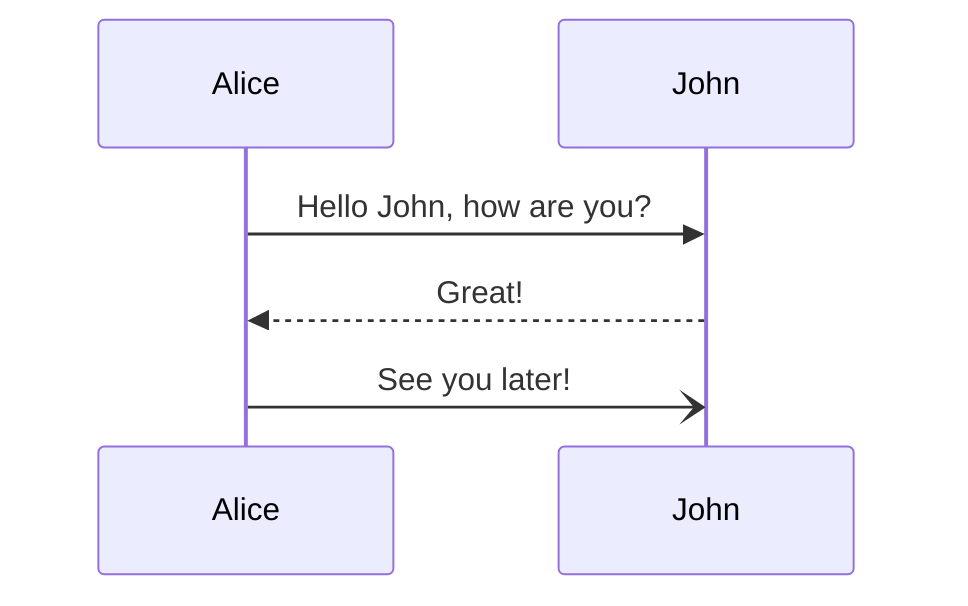

# H1 Heading (Centered, Brown)

## H2 Heading (Underline, Orange)

### H3 Heading (Yellow, Underline)

#### H4 Heading (Underline, Blue)

##### H5 Heading (Purple)

###### H6 Heading (Dark Green Uppercase)

Normal text paragraph for contrast.

## Another H2 Section

Some more text.

### Another H3

Text.
This is a demo setup for **Obsidian-Render**.

## Syntax Highlighting
```python
def hello():
    print("Hello, World!")
```

## Math
Here is an equation:
$$
E = mc^2
$$

## Tables
| Feature | Status |
| :--- | :--- |
| Markdown | ✅ |
| CSS | ✅ |
| JS | ✅ |

## Lists
- Item 1
- Item 2
    - Subitem 2.1

## Task List
- [ ] Task 1
- [x] Task 2

## Mermaid


## Callouts
> [!NOTE] Test Note
> This is a note callout.
> It works like Obsidian.

> [!WARNING]
> This is a warning without a specific title.

> [!TIP] Pro Tip
> ==Combine== highlights inside callouts!
