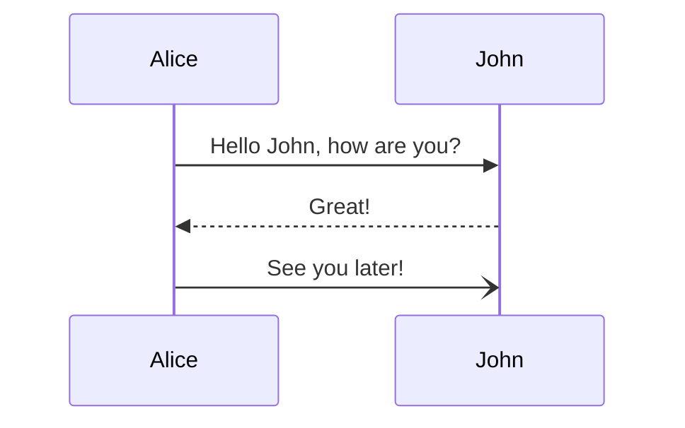

# H1 Heading (Centered, Brown)

## H2 Heading (Underline, Orange)

### H3 Heading (Yellow, Underline)

#### H4 Heading (Underline, Blue)

##### H5 Heading (Purple)

###### H6 Heading (Dark Green Uppercase)

Normal text paragraph for contrast.

## Another H2 Section

Some more text.

### Another H3

Text.
This is a demo setup for **Obsidian-Render**.

## Syntax Highlighting
```python
def hello():
    print("Hello, World!")
```

## Math
Here is an equation:
$$
E = mc^2
$$

## Tables
| Feature | Status |
| :--- | :--- |
| Markdown | ‚ú? |
| CSS | ‚ú? |
| JS | ‚ú? |

## Lists
- Item 1
- Item 2
    - Subitem 2.1

## Task List
- [ ] Task 1
- [x] Task 2

## Mermaid


## Callouts
> [!NOTE] Test Note
> This is a note callout.
> It works like Obsidian.

> [!WARNING]
> This is a warning without a specific title.

> [!TIP] Pro Tip
> ==Combine== highlights inside callouts!

## CardLink Test

```cardlink
url: https://qiita.com/gold-kou/items/966d9a0332f4e110c4f8
title: "Redis„Å®ElastiCache„ÇíÂ??„Åã„Çä„Ç?„Åô„Åè„Åæ„Å®„ÇńŶ„Åø„Å? - Qiita"
description: "„ÅØ„Åò„ÇÅ„Å´‰ªä„Åæ„Åß„Å™„ÅÅ„Å™„ÅÅ„Å´„Åó„Ŷ„Åç„ÅüRedis„Çí„ÅÑ„Åæ„Åï„Çâ„Å™„Åå„Çâ„Å´Âãâº∑„Åó„Ŷ„Åæ„Å®„ÇÅ„Åæ„Åó„Åü„ÄÇRedis„Å£„ŶËÅû„ÅÑ„Åü„Åì„Å®„ÅÇ„Çã„Åë„Å©‰∏≠Ë∫´„ÅØ„Çà„ÅèÁü•„Çâ„Å™„Å?„Å®„Åã„ÄÅ„?ó„É≠„Ç∏„Çß„ÇØ„Éà„Åß„Å™„Çì„Å®„Å™„Åè‰Ωø„Å£„Ŷ„Å?„Çã„Åë„Å©ÂÆü„?Ø„Çà„ÅèÂà?„Åã„Å£„Ŷ„Å?‚Ķ"
host: qiita.com
favicon: https://cdn.qiita.com/assets/favicons/public/production-c620d3e403342b1022967ba5e3db1aaa.ico
image: https://qiita-user-contents.imgix.net/https%3A%2F%2Fqiita-user-contents.imgix.net%2Fhttps%253A%252F%252Fcdn.qiita.com%252Fassets%252Fpublic%252Farticle-ogp-background-afbab5eb44e0b055cce1258705637a91.png%3Fixlib%3Drb-4.0.0%26w%3D1200%26blend64%3DaHR0cHM6Ly9xaWl0YS11c2VyLXByb2ZpbGUtaW1hZ2VzLmltZ2l4Lm5ldC9odHRwcyUzQSUyRiUyRnMzLWFwLW5vcnRoZWFzdC0xLmFtYXpvbmF3cy5jb20lMkZxaWl0YS1pbWFnZS1zdG9yZSUyRjAlMkYyMjE5NDglMkZhMmFlMWUwZWNkZjJjM2NmOGNmMjY1MGJiOWJhOTJiYzg5YjUxYzBjJTJGeF9sYXJnZS5wbmclM0YxNTgyOTcwNzg5P2l4bGliPXJiLTQuMC4wJmFyPTElM0ExJmZpdD1jcm9wJm1hc2s9ZWxsaXBzZSZmbT1wbmczMiZzPTc3YjExNjg2YzRmYjkxNDE5OGYwZDI1YTRhZmQwNDU0%26blend-x%3D120%26blend-y%3D462%26blend-w%3D90%26blend-h%3D90%26blend-mode%3Dnormal%26mark64%3DaHR0cHM6Ly9xaWl0YS1vcmdhbml6YXRpb24taW1hZ2VzLmltZ2l4Lm5ldC9odHRwcyUzQSUyRiUyRnMzLWFwLW5vcnRoZWFzdC0xLmFtYXpvbmF3cy5jb20lMkZxaWl0YS1vcmdhbml6YXRpb24taW1hZ2UlMkY5MzU4NjdkMzdkNjAxZTZjNzA1MjQyNDdmMzdmZDZmMjY3NjIyY2JlJTJGb3JpZ2luYWwuanBnJTNGMTYzMzAzODY5Nj9peGxpYj1yYi00LjAuMCZ3PTQ0Jmg9NDQmZml0PWNyb3AmbWFzaz1jb3JuZXJzJmNvcm5lci1yYWRpdXM9OCZib3JkZXI9MiUyQ0ZGRkZGRiZmbT1wbmczMiZzPTQzNzhhZWNjOGJmYTY4ZDUxYTU0MWNhYjNkNzNhNzYw%26mark-x%3D186%26mark-y%3D515%26mark-w%3D40%26mark-h%3D40%26s%3Dc361266d321ac5bdc943b7cf29d1280f?ixlib=rb-4.0.0&w=1200&fm=jpg&mark64=aHR0cHM6Ly9xaWl0YS11c2VyLWNvbnRlbnRzLmltZ2l4Lm5ldC9-dGV4dD9peGxpYj1yYi00LjAuMCZ3PTk2MCZoPTMyNCZ0eHQ9UmVkaXMlRTMlODElQThFbGFzdGlDYWNoZSVFMyU4MiU5MiVFNSU4OCU4NiVFMyU4MSU4QiVFMyU4MiU4QSVFMyU4MiU4NCVFMyU4MSU5OSVFMyU4MSU4RiVFMyU4MSVCRSVFMyU4MSVBOCVFMyU4MiU4MSVFMyU4MSVBNiVFMyU4MSVCRiVFMyU4MSU5RiZ0eHQtYWxpZ249bGVmdCUyQ3RvcCZ0eHQtY29sb3I9JTIzMUUyMTIxJnR4dC1mb250PUhpcmFnaW5vJTIwU2FucyUyMFc2JnR4dC1zaXplPTU2JnR4dC1wYWQ9MCZzPTdiN2QxNjg1YTEzNjhiZTRmNWE0MTNmMmVhMmJmODQ4&mark-x=120&mark-y=112&blend64=aHR0cHM6Ly9xaWl0YS11c2VyLWNvbnRlbnRzLmltZ2l4Lm5ldC9-dGV4dD9peGxpYj1yYi00LjAuMCZ3PTgzOCZoPTU4JnR4dD0lNDBnb2xkLWtvdSZ0eHQtY29sb3I9JTIzMUUyMTIxJnR4dC1mb250PUhpcmFnaW5vJTIwU2FucyUyMFc2JnR4dC1zaXplPTM2JnR4dC1wYWQ9MCZzPTMyNTc5ZGZlNWMwOGNmNWU0ZTc4NDZkMjU2YzRiYWQ2&blend-x=242&blend-y=454&blend-w=838&blend-h=46&blend-fit=crop&blend-crop=left%2Cbottom&blend-mode=normal&txt64=5qCq5byP5Lya56S-Wk9aTw&txt-x=242&txt-y=539&txt-width=838&txt-clip=end%2Cellipsis&txt-color=%231E2121&txt-font=Hiragino%20Sans%20W6&txt-size=28&s=56fdb8c0e67f71097fc2d53203caa0e4
```

## Image

![[sample-image.png|500]]
![[sample-image.png|300]]
![[sample-image.png|100]]