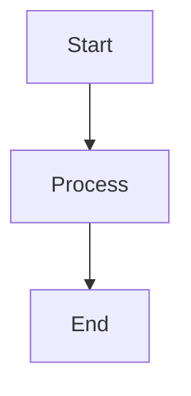

# Demo Document

# H1 Heading (Centered, Brown)

## H2 Heading (Underline, Orange)

### H3 Heading (Yellow, Underline)

#### H4 Heading (Underline, Blue)

##### H5 Heading (Purple)

###### H6 Heading (Dark Green Uppercase)

### Another H2 Section

### Another H3

## Syntax Highlighting

```python
def hello_world():
    print("Hello, World!")
    return 42
```

## Math

Inline math: $E = mc^2$

Block math:

$$
\int_{-\infty}^{\infty} e^{-x^2} dx = \sqrt{\pi}
$$

## Tables

| Feature | Status |
|---------|--------|
| Markdown | ✅ |
| Math | ✅ |
| TOC | ✅ |

## Lists

- Item 1
- Item 2
  - Nested item
  - Another nested item

1. First
2. Second
3. Third

## Task List

- [x] Completed task
- [ ] Pending task
- [ ] Another pending task

## Mermaid



## Callouts

> [!NOTE]
> This is a note callout

> [!TIP]
> This is a tip

> [!WARNING]
> This is a warning

## CardLink Test

```cardlink
url: https://github.com/obsidianmd/obsidian-releases
title: "Obsidian - A powerful knowledge base on local Markdown files"
description: "Obsidian is a powerful and extensible knowledge base that works on top of your local folder of plain text files."
host: github.com
favicon: https://github.githubassets.com/favicons/favicon.svg
image: https://github.githubassets.com/images/modules/site/social-cards/github-social.png
```

## Image

![[sample-image.png|500]]
![[sample-image.png|300]]
![[sample-image.png|100]]